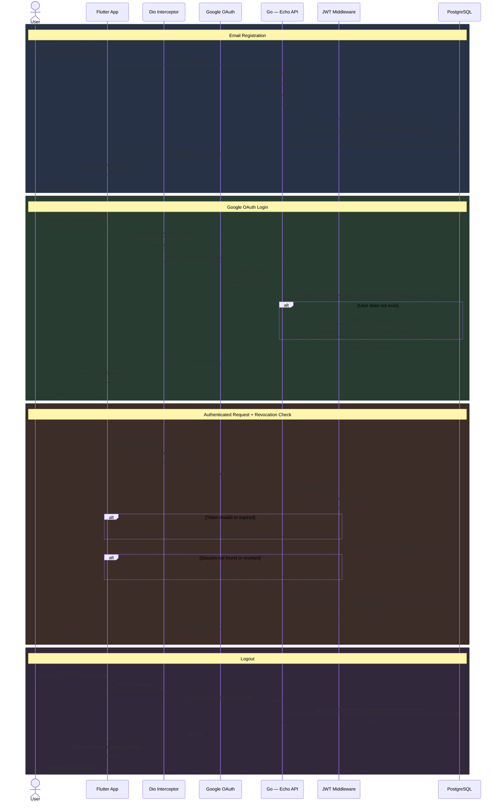

```mermaid
sequenceDiagram
    actor User
    participant App as Flutter App
    participant Dio as Dio Interceptor
    participant Google as Google OAuth
    participant API as Go — Echo API
    participant MW as JWT Middleware
    participant DB as PostgreSQL

    rect rgb(40, 50, 70)
        Note over User, DB: Email Registration
        User->>App: Enter email, name, password
        App->>API: POST /auth/register
        API->>API: Validate input
        API->>API: Hash password (bcrypt)
        API->>DB: INSERT INTO users
        API->>DB: INSERT INTO user_auth_providers (email, password_hash)
        API->>DB: INSERT INTO sessions
        API-->>App: 201 Created + session token
        App->>App: Store token in Secure Storage
        App-->>User: Redirect to home
    end

    rect rgb(40, 60, 50)
        Note over User, DB: Google OAuth Login
        User->>App: Tap Sign in with Google
        App->>Google: Trigger Google Sign-In SDK
        Google-->>App: Return ID token
        App->>API: POST /auth/google {id_token}
        API->>Google: Verify ID token
        Google-->>API: Token valid + user info
        API->>DB: SELECT FROM user_auth_providers WHERE provider_user_id = sub
        alt User does not exist
            API->>DB: INSERT INTO users
            API->>DB: INSERT INTO user_auth_providers (google, sub)
        end
        API->>DB: INSERT INTO sessions
        API-->>App: 200 OK + session token
        App->>App: Store token in Secure Storage
        App-->>User: Redirect to home
    end

    rect rgb(60, 45, 40)
        Note over User, DB: Authenticated Request + Revocation Check
        User->>App: Trigger any action
        App->>Dio: Outgoing request
        Dio->>Dio: Read token from Secure Storage
        Dio->>API: Request + Bearer token header
        API->>MW: Intercept request
        MW->>MW: Verify token signature and expiry
        alt Token invalid or expired
            MW-->>App: 401 Unauthorized
        end
        MW->>DB: SELECT FROM sessions WHERE token = hash(token)
        alt Session not found or revoked
            MW-->>App: 401 Unauthorized
        end
        MW->>API: Pass to handler
        API->>DB: Execute query
        DB-->>API: Result
        API-->>App: 200 OK + response body
        App-->>User: Render result
    end

    rect rgb(50, 40, 60)
        Note over User, DB: Logout
        User->>App: Tap logout
        App->>Dio: POST /auth/logout
        Dio->>API: Request + Bearer token header
        API->>DB: DELETE FROM sessions WHERE token = hash(token)
        DB-->>API: OK
        API-->>App: 200 OK
        App->>App: Delete token from Secure Storage
        App-->>User: Redirect to login screen
    end
```