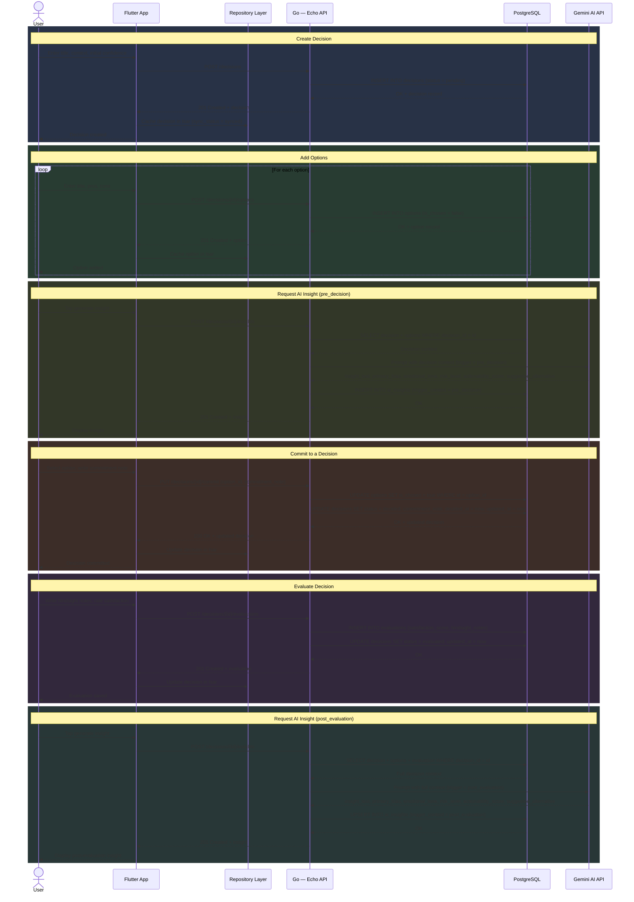

```mermaid
    sequenceDiagram
    actor User
    participant App as Flutter App
    participant Repo as Repository Layer
    participant API as Go — Echo API
    participant DB as PostgreSQL
    participant Gemini as Gemini AI API

    rect rgb(40, 50, 70)
        Note over User, Gemini: Create Decision
        User->>App: Enter title, context, initial confidence
        App->>API: POST /decisions
        API->>DB: INSERT INTO decisions (status = pending)
        DB-->>API: OK + decision record
        API-->>App: 201 Created + decision
        App->>Repo: Cache decision in Isar (sync_status = synced)
        App-->>User: Decision created
    end

    rect rgb(40, 60, 50)
        Note over User, Gemini: Add Options
        loop For each option
            User->>App: Enter title, pros, cons
            App->>API: POST /decisions/{id}/options
            API->>DB: INSERT INTO options (is_chosen = false)
            DB-->>API: OK + option record
            API-->>App: 201 Created + option
            App->>Repo: Cache option in Isar
            App-->>User: Option added
        end
    end

    rect rgb(50, 55, 40)
        Note over User, Gemini: Request AI Insight (pre_decision)
        User->>App: Tap generate insight
        App->>API: POST /decisions/{id}/insights
        API->>DB: SELECT decision + options WHERE decision_id = id
        DB-->>API: Decision context
        API->>Gemini: Prompt with decision context (trigger = pre_decision)
        Gemini-->>API: insight_text, primary_bias, emotional_tone, risk_level, actionability_score, suggested_alternative
        API->>DB: INSERT INTO ai_insights (trigger_context = pre_decision)
        DB-->>API: OK
        API-->>App: 201 Created + insight
        App-->>User: Display insight
    end

    rect rgb(60, 45, 40)
        Note over User, Gemini: Commit to a Decision
        User->>App: Select option, write commitment note
        App->>API: PUT /decisions/{id}/commit {option_id, commitment_note}
        API->>DB: UPDATE options SET is_chosen = true WHERE id = option_id
        API->>DB: UPDATE decisions SET status = decided, commitment_note, decided_at = now, updated_at = now
        DB-->>API: OK + updated decision
        API-->>App: 200 OK + updated decision
        App->>Repo: Update decision in Isar
        App-->>User: Decision committed
    end

    rect rgb(50, 40, 60)
        Note over User, Gemini: Evaluate Decision
        User->>App: Write hindsight notes, rate satisfaction
        App->>API: POST /decisions/{id}/evaluations
        API->>DB: INSERT INTO evaluations (satisfaction_score, hindsight_notes)
        API->>DB: UPDATE decisions SET status = evaluated, updated_at = now
        DB-->>API: OK
        API-->>App: 201 Created + evaluation
        App->>Repo: Update decision in Isar
        App-->>User: Evaluation saved
    end

    rect rgb(40, 55, 55)
        Note over User, Gemini: Request AI Insight (post_evaluation)
        User->>App: Tap generate insight
        App->>API: POST /decisions/{id}/insights
        API->>DB: SELECT decision + options + evaluation WHERE decision_id = id
        DB-->>API: Full decision context
        API->>Gemini: Prompt with full context (trigger = post_evaluation)
        Gemini-->>API: insight_text, primary_bias, emotional_tone, risk_level, actionability_score, suggested_alternative
        API->>DB: UPSERT INTO ai_insights (trigger_context = post_evaluation)
        DB-->>API: OK
        API-->>App: 201 Created + insight
        App-->>User: Display post-evaluation insight
    end
```