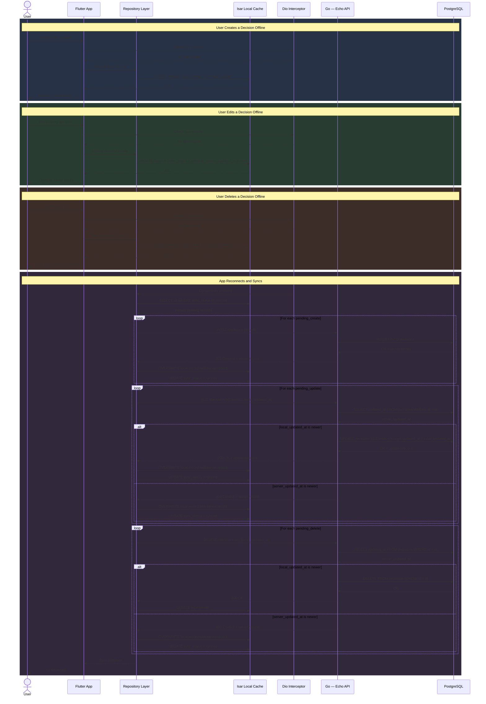

```mermaid
sequenceDiagram
    actor User
    participant App as Flutter App
    participant Repo as Repository Layer
    participant Isar as Isar Local Cache
    participant Dio as Dio Interceptor
    participant API as Go — Echo API
    participant DB as PostgreSQL

    rect rgb(40, 50, 70)
        Note over User, DB: User Creates a Decision Offline
        User->>App: Create new decision
        App->>Dio: Check connectivity
        Dio-->>App: No connectivity
        App->>Repo: Save decision locally
        Repo->>Isar: INSERT decision (sync_status = pending_create)
        Isar-->>App: OK
        App-->>User: Decision saved locally
    end

    rect rgb(40, 60, 50)
        Note over User, DB: User Edits a Decision Offline
        User->>App: Edit existing decision
        App->>Dio: Check connectivity
        Dio-->>App: No connectivity
        App->>Repo: Update decision locally
        Repo->>Isar: UPDATE decision (sync_status = pending_update, updated_at = now)
        Isar-->>App: OK
        App-->>User: Changes saved locally
    end

    rect rgb(60, 45, 40)
        Note over User, DB: User Deletes a Decision Offline
        User->>App: Delete decision
        App->>Dio: Check connectivity
        Dio-->>App: No connectivity
        App->>Repo: Mark decision for deletion
        Repo->>Isar: UPDATE decision (sync_status = pending_delete)
        Isar-->>App: OK
        App-->>User: Decision removed from view
    end

    rect rgb(50, 40, 60)
        Note over User, DB: App Reconnects and Syncs
        Dio->>Repo: Connectivity restored
        Repo->>Isar: SELECT all WHERE sync_status != synced
        Isar-->>Repo: Return pending records

        loop For each pending_create
            Repo->>API: POST /decisions {record}
            API->>DB: INSERT INTO decisions
            DB-->>API: OK + server record
            API-->>Repo: 201 Created + server record
            Repo->>Isar: OVERWRITE local record with server record
            Repo->>Isar: UPDATE sync_status = synced
        end

        loop For each pending_update
            Repo->>API: PUT /decisions/{id} {record, local_updated_at}
            API->>DB: SELECT updated_at FROM decisions WHERE id = id
            DB-->>API: server_updated_at
            alt local_updated_at is newer
                API->>DB: UPDATE decisions SET fields = record, updated_at = local_updated_at
                DB-->>API: OK + updated record
                API-->>Repo: 200 OK + updated record
                Repo->>Isar: OVERWRITE local record with server record
                Repo->>Isar: UPDATE sync_status = synced
            else server_updated_at is newer
                API-->>Repo: 409 Conflict + server record
                Repo->>Isar: OVERWRITE local record with server record
                Repo->>Isar: UPDATE sync_status = synced
            end
        end

        loop For each pending_delete
            Repo->>API: DELETE /decisions/{id} {local_updated_at}
            API->>DB: SELECT updated_at FROM decisions WHERE id = id
            DB-->>API: server_updated_at
            alt local_updated_at is newer
                API->>DB: DELETE FROM decisions WHERE id = id
                DB-->>API: OK
                API-->>Repo: 200 OK
                Repo->>Isar: DELETE local record
            else server_updated_at is newer
                API-->>Repo: 409 Conflict + server record
                Repo->>Isar: OVERWRITE local record with server record
                Repo->>Isar: UPDATE sync_status = synced
            end
        end

        Repo-->>App: Sync complete
        App-->>User: UI refreshed
    end
```