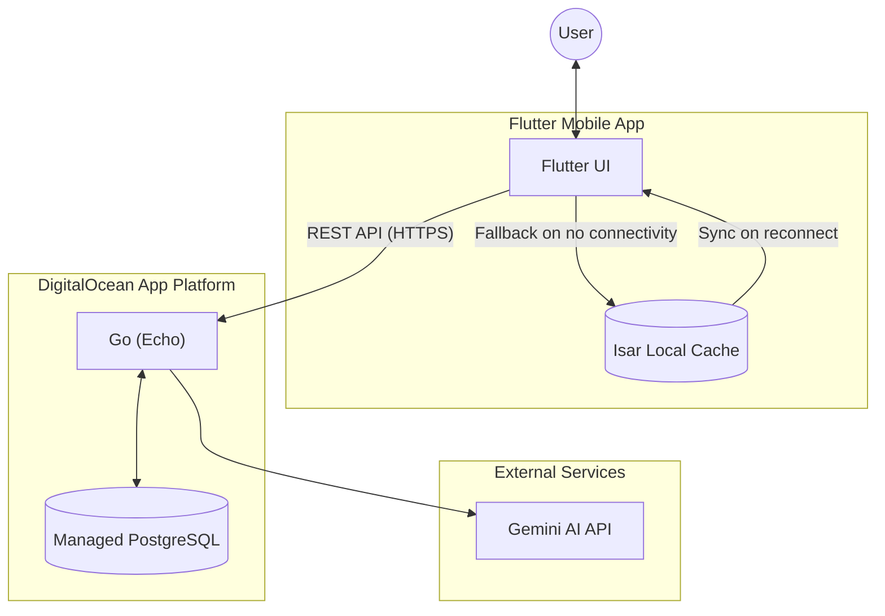

```mermaid
graph TD
    User((User)) <--> App

    subgraph Client ["Flutter Mobile App"]
        App[Flutter UI]
        App -- "Fallback on no connectivity" --> Isar[(Isar Local Cache)]
        Isar -- "Sync on reconnect" --> App
    end

    subgraph Backend ["DigitalOcean App Platform"]
        API["Go (Echo)"]
        DB[(Managed PostgreSQL)]
        API <--> DB
    end

    subgraph External ["External Services"]
        Gemini["Gemini AI API"]
    end

    App -- "REST API (HTTPS)" --> API
    API --> Gemini
```