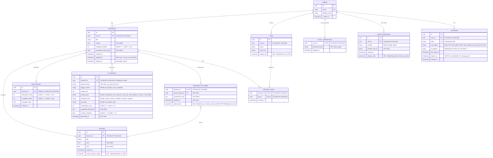

```mermaid
erDiagram
    USERS ||--o{ DECISIONS : logs
    USERS ||--o{ TAGS : creates
    USERS ||--o| LOCAL_CREDENTIALS : uses_password
    USERS ||--o{ OAUTH_IDENTITIES : uses_oauth
    USERS ||--o{ SESSIONS : has
    
    DECISIONS ||--|{ OPTIONS : considers
    DECISIONS ||--o| EVALUATIONS : undergoes
    DECISIONS ||--o{ AI_INSIGHTS : generates
    
    DECISIONS ||--o| DECISION_OUTCOMES : resolved_by
    DECISION_OUTCOMES }o--|| OPTIONS : selects

    
    DECISIONS ||--o{ DECISION_TAGS : has
    TAGS ||--o{ DECISION_TAGS : applied_to

    
    USERS {
        uuid id PK
        string email UK
        string display_name
        timestamp created_at
    }
    LOCAL_CREDENTIALS {
        uuid user_id PK,FK  "ON DELETE CASCADE"
        string password_hash "NOT NULL bcrypt"
        timestamp updated_at
    }
    OAUTH_IDENTITIES {
        uuid id PK
        uuid user_id FK "ON DELETE CASCADE"
        string provider "ENUM: google, github"
        string provider_user_id "NOT NULL"
        timestamp created_at
        constraint unique_oauth "DDL: UNIQUE(provider, provider_user_id)"
    }
    SESSIONS {
        uuid id PK
        uuid user_id FK "ON DELETE CASCADE"
        string token UK "Hashed SHA-256"
        string user_agent "Raw HTTP User-Agent TODO: Many systems store only device hash."
        string ip_address "Masked per UU PDP e.g. 192.168.1.***"
        timestamp last_used_at
        timestamp expires_at "CRITICAL: hard-delete TTL using pg_cron"
        timestamp created_at
    }
    TAGS {
        uuid id PK
        uuid user_id FK "ON DELETE CASCADE"
        string name
        string color_hex
        constraint unique_tag "DDL: UNIQUE(user_id, name)"
    }
    DECISION_TAGS {
        uuid decision_id PK,FK "ON DELETE CASCADE"
        uuid tag_id PK,FK "ON DELETE CASCADE"
        timestamp created_at
    }
    DECISIONS {
        uuid id PK
        uuid user_id FK "ON DELETE CASCADE"
        string title
        text context "NULLABLE"
        int confidence_before "CHECK: >= 1 AND <= 100"
        date scheduled_review_date "NULLABLE"
        timestamp created_at
        timestamp updated_at "NOT NULL, set on every UPDATE"
        timestamp deleted_at "Soft delete marker"
        %% CREATE VIEW active_decisions AS
        %% SELECT * FROM decisions WHERE deleted_at IS NULL;
        %% CREATE INDEX idx_active_decisions_user 
        %% ON decisions(user_id) 
        %% WHERE deleted_at IS NULL;
    }
    DECISION_OUTCOMES {
        uuid decision_id PK,FK "ON DELETE CASCADE"
        uuid chosen_option_id FK "NOT NULL"
	    text commitment_note "NULLABLE"
        timestamp decided_at "NOT NULL"
        constraint valid_choice "DDL: FK(decision_id, chosen_option_id) REF OPTIONS(decision_id, id)"
    }
    OPTIONS {
        uuid id PK
        uuid decision_id FK "ON DELETE CASCADE"
        string title
        text pros "NULLABLE"
        text cons "NULLABLE"
        timestamp created_at
        constraint unique_decision_option "DDL: UNIQUE(decision_id, title)"
    }
    EVALUATIONS {
        uuid id PK
        uuid decision_id FK "UNIQUE. ON DELETE CASCADE"
        int satisfaction_after "CHECK: >= 1 AND <= 100"
        int confidence_after "CHECK: >= 1 AND <= 100"
        text hindsight_notes
        timestamp created_at
    }
    AI_INSIGHTS {
        uuid id PK
        uuid decision_id FK "ON DELETE CASCADE. Compliance critical."
        string model_version "NOT NULL e.g. gpt-4o-2024-11"
        string trigger_context "ENUM: pre_decision, post_evaluation"
        text insight_text
        string primary_bias "ENUM: confirmation, loss_aversion, sunk_cost, overconfidence, recency . NULLABLE"
        string emotional_tone "ENUM: neutral, anxious, confident, uncertain, regretful"
        string risk_level "ENUM: low, medium, high"
        int actionability_score "CHECK: >= 1 AND <= 10"
        text suggested_alternative "NULLABLE"
        float model_confidence "CHECK: >= 0.0 AND <= 1.0"
        timestamp generated_at "NOT NULL"
    }
```
