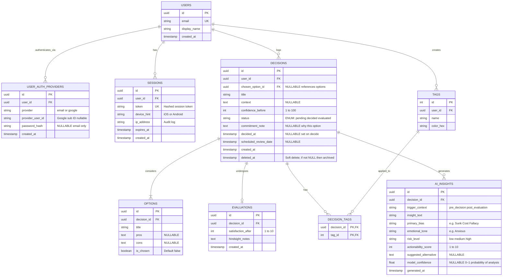

```mermaid
    erDiagram
        USERS ||--o{ USER_AUTH_PROVIDERS : authenticates_via
        USERS ||--o{ SESSIONS : has
        USERS ||--o{ DECISIONS : logs
        USERS ||--o{ TAGS : creates
        DECISIONS ||--|{ OPTIONS : considers
        DECISIONS ||--o| EVALUATIONS : undergoes
        DECISIONS ||--o{ DECISION_TAGS : has
        DECISIONS ||--o{ AI_INSIGHTS : generates
        TAGS ||--o{ DECISION_TAGS : applied_to

        USERS {
            uuid id PK
            string email UK
            string display_name
            timestamp created_at
        }

        USER_AUTH_PROVIDERS {
            uuid id PK
            uuid user_id FK
            string provider "email or google"
            string provider_user_id "Google sub ID nullable"
            string password_hash "NULLABLE email only"
            timestamp created_at
        }

        SESSIONS {
            uuid id PK
            uuid user_id FK
            string token UK "Hashed session token"
            string device_hint "iOS or Android"
            string ip_address "Audit log"
            timestamp expires_at
            timestamp created_at
        }

        TAGS {
            int id PK
            uuid user_id FK
%%          Each user cannot create duplicate tag names.
            string name
            string color_hex
        }

        DECISION_TAGS {
            uuid decision_id PK,FK
            int tag_id PK,FK
        }

        DECISIONS {
            uuid id PK
            uuid user_id FK
            uuid chosen_option_id FK "NULLABLE references options"
            string title
            text context "NULLABLE"
            int confidence_before "1 to 100"
            string status "ENUM: pending decided evaluated"
%%              CHECK (status IN ('pending', 'decided', 'evaluated'))
%%              DEFAULT 'pending'
            text commitment_note "NULLABLE why this option"
            timestamp decided_at "NULLABLE set on decide"
            timestamp scheduled_review_date "NULLABLE"
            timestamp created_at
            timestamp deleted_at "Soft delete; if not NULL then archived"
        }

        OPTIONS {
            uuid id PK
            uuid decision_id FK
            string title
            text pros "NULLABLE"
            text cons "NULLABLE"
            boolean is_chosen "Default false"
        }

        EVALUATIONS {
            uuid id PK
            uuid decision_id FK
            int satisfaction_after "1 to 10"
            text hindsight_notes
            timestamp created_at
        }

        AI_INSIGHTS {
            uuid id PK
            uuid decision_id FK
            string trigger_context "pre_decision post_evaluation"
            string insight_text
            string primary_bias "e.g. Sunk Cost Fallacy"
            string emotional_tone "e.g. Anxious"
%%             ENUM:
%%              anxious
%%              confident
%%              neutral
%%              uncertain
%%              regretful
            string risk_level "low medium high"
            int actionability_score "1 to 10"
            text suggested_alternative "NULLABLE"
            float model_confidence "NULLABLE 0–1 probability of analysis"
            timestamp generated_at
        }
```
