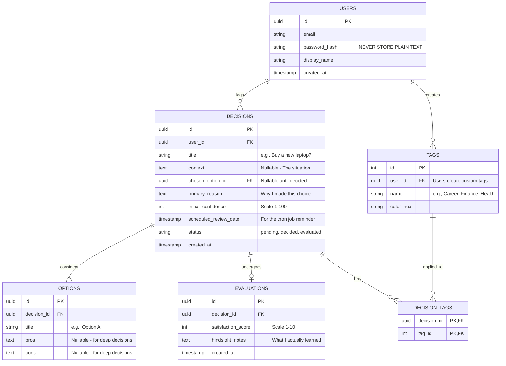

```mermaid
erDiagram
    USERS ||--o{ DECISIONS : logs
    USERS ||--o{ TAGS : creates
    DECISIONS ||--|{ OPTIONS : considers
    DECISIONS ||--o| EVALUATIONS : undergoes
    DECISIONS ||--o{ DECISION_TAGS : has
    TAGS ||--o{ DECISION_TAGS : applied_to

    USERS {
        uuid id PK
        string email
        string password_hash "NEVER STORE PLAIN TEXT"
        string display_name
        timestamp created_at
    }
    
    TAGS {
        int id PK
        uuid user_id FK "Users create custom tags"
        string name "e.g., Career, Finance, Health"
        string color_hex 
    }

    DECISION_TAGS {
        uuid decision_id PK, FK
        int tag_id PK, FK
    }

    DECISIONS {
        uuid id PK
        uuid user_id FK
        string title "e.g., Buy a new laptop?"
        text context "Nullable - The situation"
        uuid chosen_option_id FK "Nullable until decided"
        text primary_reason "Why I made this choice"
        int initial_confidence "Scale 1-100"
        timestamp scheduled_review_date "For the cron job reminder"
        string status "pending, decided, evaluated"
        timestamp created_at
    }
    
    OPTIONS {
        uuid id PK
        uuid decision_id FK
        string title "e.g., Option A"
        text pros "Nullable - for deep decisions"
        text cons "Nullable - for deep decisions"
    }
    
    EVALUATIONS {
        uuid id PK
        uuid decision_id FK
        int satisfaction_score "Scale 1-10"
        text hindsight_notes "What I actually learned"
        timestamp created_at
    }
```